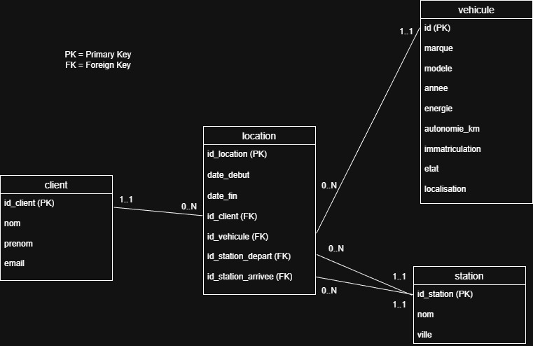

# Rapport de Projet : cIAra Mobility

## Présentation de l'équipe
* **Membre 1 :** Florent Folliard - Modélisation et Développement
* **Membre 2 :** Oscar Vivien - Versionning et Documentation du rapport

---

## Présentation du projet
Ce projet porte sur le traitement de données d'une entreprise de location de vehicules cIAra Mobility.
Les seules données dont nous avions accès étaient celles des véhicules, nous avions dû réfléchir à une organisation cohérente entre les différents tableaux comme si l'on devait créer une base de donnée professionnelle à partir de zéro. 

---

## Modélisation (MCD)
L'architecture repose sur un modèle "en étoile" dont la table **location** constitue le pivot central.
Cela permet de stocker des données sur les clients, les stations et les véhicules sans affecter le tableau de location.

### Cardinalités et règles de gestion :
* **Client (1,1) <---> (0,N) Location** : Une location est obligatoirement associée à un client unique. Un client peut exister dans la base sans historique de location.
* **Véhicule (1,1) <---> (0,N) Location** : Chaque véhicule possède un identifiant unique permettant un suivi précis de ses cycles d'utilisation.
* **Station (1,1) <---> (0,N) Location** : La table location gère deux relations distinctes avec la table station (départ et arrivée).

---

## Structure de la base de données

| Table | Fonction | Clé Primaire |
| :--- | :--- | :--- |
| **client** | Données des clients | `id_client` (SERIAL) |
| **vehicule** | Données des vehicules (la flotte) | `id` (SERIAL) |
| **station** | Données des points de ratrait et dépôt | `id_station` (SERIAL) |
| **location** | Historique des locations contenant toutes les données réunies | `id_location` (SERIAL) |

---

## Difficultés rencontrées
* **Gestion de l'ordre d'insertion** : La création des tableaux était aussi délicat que de créer les requêtes car il fallait construire une base solide qui respecte les hiérarchies entre elles pour mener à bien les requêtes ensuite.
Il a fallu dans un premier temps créer des tables tampons qui possèdent des colonnes cohérentes pour y accueillir les futures données.
Possédant déjà les données des véhicules, on a dû respecter les la cohérence des colonnes présentes dans le CSV.
Concernant la table Location c'était aussi un peu complexe car c'est dans cette table qu'il fallait appliquer les logiques de clés étrangères.
* **Double jointure sur une même table** : Concernant le tableau location, nous avions deux clés étrangères reliées à une clé primaire. Il a donc fallu faire preuve d'imagination pour mener à bien la quête 3.3 en utilisant une double jointure et des alias.

---

## Conclusion
Le projet nous a permi de nous mettre en condition face à une base de données quasi vierge, simplement des données de véhicules à disposition pour y construire une architecture cohérente autour de ça. 
C'est en comprenant les besoins du projet à travers les quêtes que nous avons pu déterminer quelles logiques appliquer.